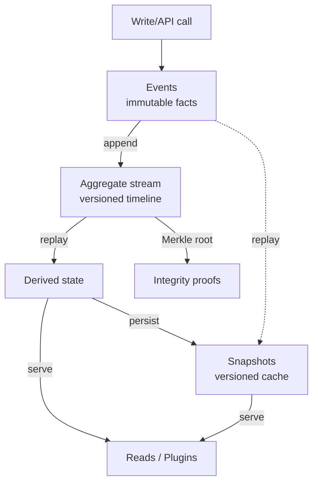

Every state change flows through three artifacts: events, the aggregates they append to, and snapshots that keep reads fast. Calibrate each piece deliberately so you can replay history, prove integrity, and power downstream projections without touching the write path.

**How they fit together**

- Events are immutable facts appended in order; they are the single source of truth and anchor Merkle proofs.
- Aggregates group related events, enforce identifiers and schemas, and expose the current state derived from the full event stream.
- Snapshots cache that derived state at specific versions so reads and plugins stay fast without replaying the entire history.
- Replays rebuild snapshots from events; snapshots prove what state existed at a version; aggregates tie both to a consistent identity.
- Derived aggregate state can also serve reads/plugins directly when you don't need a cached snapshot.

## Snapshots

- Materialize deterministic snapshots to serve reads quickly without replaying full histories.
- Schedule rebuilds or let EventDBX auto-refresh them once schema thresholds are reached; add `dbx snapshots create` for point-in-time checkpoints before migrations or audits.
- Tune retention, compression, and pruning strategies to balance cost versus recovery speed; pair exports with Merkle roots to prove integrity.

[Deep dive → Snapshot guide](../aggregate-events/snapshot)

## Aggregates

- Keep identifiers stable, scoped, and easy to shard across teams.
- Use metadata to track lifecycle decisions, ownership, and reconciliation markers.
- Avoid coupling unrelated concerns into a single aggregate—fan out instead; use domains to hard-wall environments and tenants via `dbx checkout`.

[Deep dive → Aggregate guide](../aggregate-events/aggregate)

## Events

- Version payload schemas carefully so older events remain readable.
- Lean on metadata for traceability, idempotency, and auditing hooks; `extensions-only` payload mode lets plugins consume hints without payloads.
- Rebuild downstream read models by plugin-replaying events (`dbx plugin replay … --payload-mode <mode>`) whenever integrations drift; queue backoff keeps writes decoupled from slow consumers.

[Deep dive → Event guide](../aggregate-events/events)
