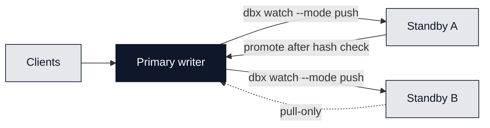
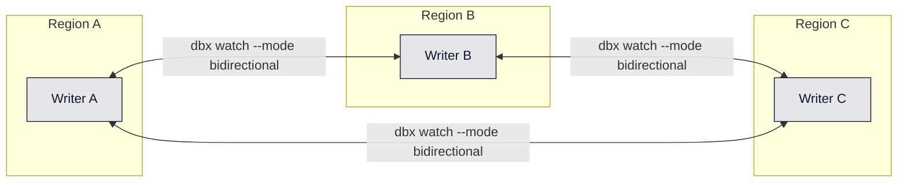
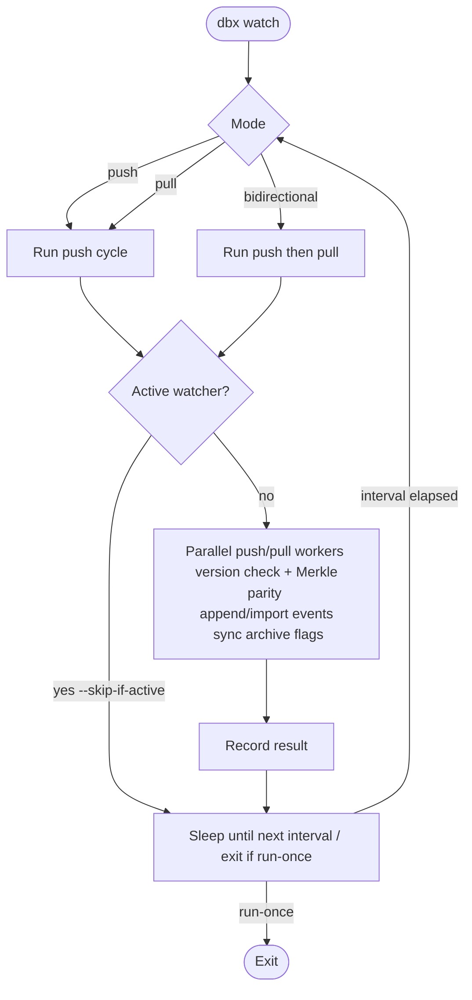

EventDBX replication is flexible: you can run a primary/standby pattern or a multi-writer mesh. `push`, `pull`, and `watch` keep Merkle trees aligned across nodes; divergences stop the sync so you never rewrite history silently.
Replication is asynchronous, not a distributed transaction. Expect lag that depends on your `watch` interval (`--interval <secs>`, default 300) or how often you run `push`/`pull`.

## Remote setup and schemas

- Remote connection details (address, token, optional tenant) are stored per domain in `remote.json`; configure them with `dbx checkout -d <domain> --remote <host:port> --token "<token>" [--remote-tenant <id>]` so `push`/`pull`/`watch` know where to talk.
- Schemas replicate separately with `dbx push schema <domain>` / `dbx pull schema <domain>`; `--publish` activates the pushed snapshot on the remote.
- Typical flow: checkout and configure the remote, push schemas, then `dbx push <domain> [--aggregate <type> --id <agg_id> --concurrency N]`; later `dbx pull <domain> [...]` to ingest new remote events. `dbx watch <domain> --mode push|pull|bidirectional --interval <secs> [--background]` schedules recurring syncs (see README.md and docs/cli.md).

## Pattern 1: Standby (one writer)

- Pick a single writer (primary) per domain; configure standbys as pull-only or accept pushes from the primary.
- Use `dbx watch <remote> --mode push` on the primary to stream changes out, or `--mode pull` on standbys to ingest from the primary. Either way, only one side writes.
- Before promoting a standby, compare Merkle roots and last offsets; cut writes to the old primary, then flip clients.
- Example (hospital hub-and-spoke): the regional data center writes; each facility runs `dbx watch hub --mode pull` to stay current. If the hub fails, promote one facility after verifying hashes.
- Attach remotes per domain (persisted in `remote.json`) with `dbx checkout -d <domain> --remote <host[:port]> --token <value> [--remote-tenant <id>]` so subsequent `push`/`pull`/`watch` calls reuse stored endpoints and credentials.



## Pattern 2: Mesh (multi-writer)

- Allow writes in multiple regions, then synchronise with `dbx watch --mode bidirectional` between peers. Use fine-grained scopes (`--aggregate`, `--id`) to limit blast radius if needed.
- Conflicts are avoided by design: EventDBX aborts on diverging histories. If two writers append conflicting events to the same aggregate, resolve by choosing the authoritative timeline and reseeding the other node.
- Example (hospital mesh): facilities in different regions write local events (admissions, vitals), and peers run `dbx watch <peer> --mode bidirectional --aggregate patient` so patient aggregates converge. If a conflict surfaces, pick the authoritative facility and re-sync from it.



## Replication command reference

### watch

Streams changes continuously with automatic retries and backoff.

```bash
dbx watch standby-a --mode push --background
dbx watch primary --mode pull --aggregate patient
dbx watch peer-1 --mode bidirectional --aggregate patient --id p-001 --run-once
```

- Modes: `push` (send to remote), `pull` (ingest from remote), `bidirectional` (push then pull in one cycle).
- Mechanics: reuses the same safety rails as one-off push/pull (version guardrails, Merkle root parity, archive flag sync) and reads remote settings from `remote.json` written by `dbx checkout`.
- Scopes: `--aggregate <type>`, `--id <aggregate_id>` to target specific streams.
- Flags: `--background` to daemonise, `--run-once` for a single pass, `--skip-if-active` to avoid overlap (state is persisted so `dbx watch status <domain>` can report last result), `--concurrency <threads>` to tune parallelism.



### push

One-off transfer from the current domain to a remote (daemon must be stopped for the target domain).

```bash
dbx push standby-b
dbx push standby-b --aggregate patient --id p-001 --concurrency 8
```

- Scopes: `--aggregate <type>`, `--id <aggregate_id>`; otherwise every aggregate is considered.
- Throughput: `--concurrency <threads>` (defaults to CPU count) fans work across aggregates.
- Mechanics: ensures the local RocksDB store exists (`CURRENT` file present) and the daemon is stopped, then for each aggregate refuses to push if the remote is ahead, compares Merkle roots at the remote version, creates the aggregate remotely if missing, appends only the missing events, and mirrors archive status.
- Consistency: aborts on divergence, exits cleanly when everything is already synchronised, and never overwrites remote history.

### pull

One-off ingest from a remote into the current domain.

```bash
dbx pull primary
dbx pull primary --aggregate patient --id p-001 --concurrency 8
```

- Scopes: `--aggregate <type>`, `--id <aggregate_id>`.
- Throughput: `--concurrency <threads>` across aggregates.
- Mechanics: lists matching aggregates from the remote, refuses to run if the local copy is ahead, fetches only new events, recomputes the Merkle root to validate the combined history, imports events, and synchronises archive flags locally.
- Safety: aborts on any version/hash mismatch to avoid rewriting local history and returns success when nothing changed.

### Monitoring and recovery

- Commands exit non-zero on failure; wrap `push`/`pull` in retries or let `watch` run continuously.
- Monitor `/metrics` (Prometheus) for replication counters and lag.
- On failure: identify the last successful aggregate/version, rerun scoped `push|pull` or restart `watch` (it resumes from its cursor). If a divergence is detected, pick the authoritative side, reseed with `push|pull`, then restart `watch`.
- Safety guarantees: refuses overwrites when versions diverge, checks Merkle root parity before applying deltas, and short-circuits when there is nothing new.
- Always push schemas first (`dbx push schema <remote>`) before syncing events so validation stays in lockstep.
