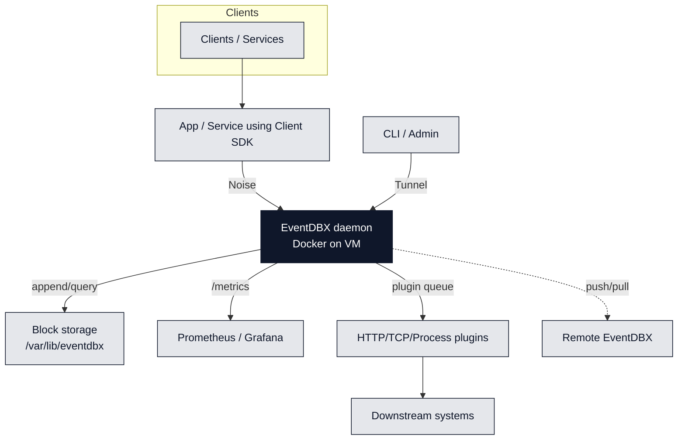

## Run with Docker

```bash
# Pull the latest published release
docker pull thachp/eventdbx:latest

# Start the daemon with persistent storage and required ports
docker run \
  --name eventdbx \
  --detach \
  --publish 7070:7070 \
  --publish 6363:6363 \
  --volume "$PWD/data:/var/lib/eventdbx" \
  thachp/eventdbx:latest
```

- The image publishes to Docker Hub as `thachp/eventdbx`, so `docker pull` always grabs the latest signed release you can test locally on macOS, Linux, or WSL without extra installers.
- Mount a persistent volume so Merkle trees, schemas, and queued jobs survive restarts.
- Port `7070` exposes the HTTP API and `/metrics` endpoint for monitoring; `6363` is the Noise-secured control + replication socket the CLI, client SDK, `watch`, and peers use—apps typically talk via the SDK on `6363`.
- Pass `--env EVENTDBX_RESTRICT=strict` or update `config.toml` inside the volume to enforce schema validation globally.

<Tip>
  The Docker image bundles the same `dbx` binary as the CLI, so you can exec
  into the container and run administrative commands without installing extra
  tooling.
</Tip>

## Promote to cloud VMs

When you are ready for production, reuse the same Docker Hub image on a virtual machine and keep the data directory on attached block storage:

- **Azure:** Attach a Managed Disk (Premium SSD or Ultra) to the VM, format it (e.g., `/mnt/eventdbx`), and bind-mount it into Docker with `--volume /mnt/eventdbx:/var/lib/eventdbx`.
- **GCP:** Add a Persistent Disk, mount it under `/var/lib/eventdbx`, and either run the container via `gcloud compute ssh` or use a startup script that runs `docker run ... --volume /var/lib/eventdbx:/var/lib/eventdbx`.
- **AWS:** Provision an EBS volume (gp3 or io2), attach it to the EC2 instance, mount it (such as `/data/eventdbx`), and pass that mount into Docker.

In every cloud, ensure the VM’s firewall allows the same `7070`/`6363` ports and that the attached volume is marked to persist independently of the VM lifecycle so you never lose aggregate history if the machine reboots or is replaced.

## Cloud reference diagram



## Security defaults

- EventDBX is designed to sit behind your application servers or API gateway, not as a public-facing endpoint. Keep the container on a private VPC / VNet subnet and restrict inbound traffic to trusted app hosts or VPN jump boxes.
- If ports `7070`/`6363` accidentally reach the public internet, the Noise Protocol handshake plus JWT-based auth still gate every request, so unauthenticated clients cannot replay traffic or bypass signature checks—but plan to rotate credentials and lock the network down immediately.
- Tokens use Ed25519 signatures configured under `[auth]` in `config.toml`. Store the private key on the server only; distribute the public key to services that validate tokens.
- Event payloads, aggregate snapshots, and `tokens.json` encrypt transparently when you provide a data-encryption key via `dbx config --dek <base64>`. Metadata (aggregate ids, Merkle roots) stays readable so plugins and integrity checks continue working.

## Observability

- Prometheus-compatible metrics live under `/metrics` on the HTTP port. They include request latency, plugin queue depth, and retry counters so you can wire dashboards in Grafana, Datadog, or any collector that speaks the Prometheus exposition format.
- Use `dbx queue`, `dbx queue retry`, and `dbx queue clear` to inspect or remediate jobs that failed fan-out. Retries use exponential backoff until the plugin succeeds or the aggregate disappears.

## Backups and restores

Stop the server before snapshotting the data directory to avoid partial Merkle trees.

```bash
dbx backup --output ~/backups/eventdbx.tar.gz
dbx restore --input ~/backups/eventdbx.tar.gz --data-dir /var/lib/eventdbx
```

Pass `--force` to overwrite non-empty destinations and `--data-dir` to restore into a custom path.
