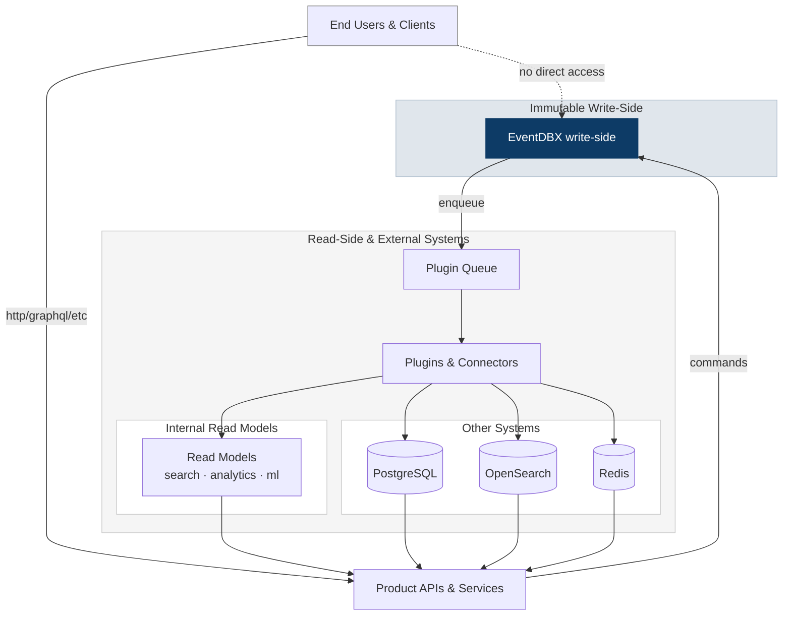

EventDBX is an append-only, event-sourced write database that keeps your aggregates verifiable, replicas aligned, and downstream systems hydrated without touching the write path. Instead of hand-building bespoke schemas up front, you capture events, validate them with Merkle-backed integrity checks, and fan them out through plugins that specialize in the read side.

## Core Motivations

EventDBX succeeds when it:

- Enables developers to quickly build applications without hand-designing schemas or wrestling with ORMs; schemas stay an afterthought you tighten later.
- Enforces task-based thinking over CRUD. Start from what customers tell you and persist what they know instead of designing tables first and training users to fit them; workflows stay aligned with intent.
- Provides a trustworthy source of truth for other systems. The append-only event log plus Merkle verification prevents silent edits—no administrator can tweak a column without leaving evidence—so downstream systems can trust replicated histories instead of worrying about invisible hotfixes.

<Tip>
  The CLI binary is `dbx`; older releases exposed an `eventdbx` alias, but `dbx`
  is the canonical entry point.
</Tip>

## Architecture at a glance

EventDBX follows the CQRS first principle: isolate the write path (capture + validate + append) from read responsibilities (materialization, search, analytics) so each side can scale and evolve independently. EventDBX is deliberately write-path-first—plugins own the read models so writes stay fast, append-only, and verifiable.

1. **Events in, state verified** – `dbx aggregate apply` validates payloads (when restriction is enabled), merges them into the aggregate snapshot, and appends the event. Per-aggregate Merkle trees detect tampering immediately.
2. **Plugins out** – every committed event flows into a durable job queue. TCP/HTTP/log/process emitters decide which payload slices they care about, while queue backoff keeps delivery reliable.
3. **Domains & replication** – `dbx checkout` creates isolated storage roots per bounded context, and `dbx push/pull/watch` mirror those roots across environments with concurrency controls.

## Where EventDBX fits

EventDBX lives on the write side: only trusted services send commands, and plugins keep read models fresh. End users never touch EventDBX directly—they hit the downstream systems that plugins maintain.

<Note>
  The diagram shows commands flowing into EventDBX, jobs entering the plugin
  queue, and fan-out into read models that front the user-facing APIs.
</Note>

## Choose your next step

<CardGroup cols={3}>
  <Card title="Spin it up" icon="rocket" href="/quickstart">
    Follow the CLI quickstart to start the daemon, define schemas, and append
    your first events.
  </Card>
  <Card title="Understand the surface area" icon="circle-info" href="/features">
    Explore built-in capabilities—immutability, encryption, restriction modes,
    performance, and column types.
  </Card>
  <Card title="Operate & integrate" icon="server" href="/deployment">
    Run EventDBX under Docker, issue tokens, connect TypeScript clients, and
    schedule replication jobs.
  </Card>
</CardGroup>

## Performance snapshot

EventDBX keeps throughput flat even as datasets grow past 50M records (~100 GB of storage) thanks to RocksDB batching and hot-aggregate caching.

| Engine          | Throughput (ops/s) | Latency (µs)  | Notes                                                        |
| --------------- | ------------------ | ------------- | ------------------------------------------------------------ |
| **EventDBX**    | **1 400 – 2 000**  | **0.5 – 0.8** | Append-only core plus caching keeps latency sub-microsecond. |
| PostgreSQL 15   | 1 000 – 1 900      | 0.6 – 1.0     | Strong baseline, heavier planner/WAL overhead.               |
| MongoDB 7       | 400 – 1 000        | 1.5 – 2.5     | Flexible JSON store with higher serialization cost.          |
| SQL Server 2022 | 50 – 180           | 5 – 20        | Drops quickly past 100 K ops because of locking + B-trees.   |

Benchmarks come from the [eventdbx-perf](https://github.com/eventdbx/eventdbx-perf) suite (Dockerized backends, single-threaded clients, datasets up to 50M records).
