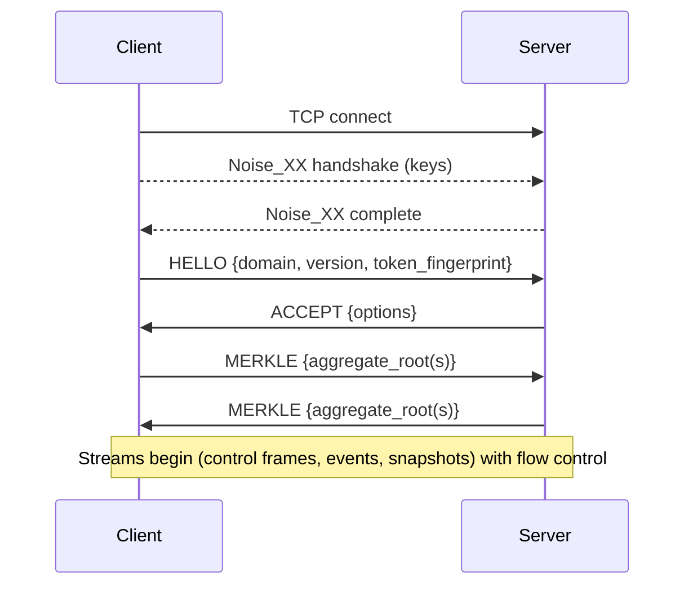

EventDBX uses Cap’n Proto in three places:

- **Plugin delivery**: the Capnp plugin sends event/state/schema envelopes over TCP to a listening worker, respecting each plugin’s payload mode.
- **Control channel (CLI/SDK)**: Cap’n Proto frames carry `create/apply/patch/archive/restore`, snapshot, and read operations (`get/list/select/events/verify`, schema list, etc.) over a Noise-secured TCP connection.
- **Replication (captain)**: Cap’n Proto over TCP synchronises domains between nodes, with Noise handshakes and Merkle prechecks to prevent silent drift.

Both transports keep latency low and structure the payload so downstream services can decode without JSON overhead.

## Plugin delivery payloads

- Envelope fields: aggregate id/type, event type/version/id, payload JSON, metadata JSON, extensions JSON, hash, Merkle root, optional state entries, optional schema JSON.
- Payload modes (`all`, `event-only`, `state-only`, `event-and-schema`, `extensions-only`) strip unused sections before send.
- Sequence numbers increment per connection so receivers can order/dedupe deliveries.
- Transport: TCP to the configured host:port from the plugin definition; the queue lives in EventDBX, connections are short-lived per delivery.

## Handshake at a glance



## Control RPCs (CLI/SDK)

The CLI and SDKs use the same Cap’n Proto control channel (over Noise + TCP, default 6363) for write and read verbs:

- Writes: `create`, `apply`, `patch`, `archive`, `restore`, snapshot `create`.
- Reads: `get`, `list`, `select`, `events`, `verify`, snapshot `list`/`get`, schema `list`.
- Every request includes the domain (tenant) and bearer token; responses carry JSON-encoded payloads and cursors.

Configure remotes per domain with `dbx checkout <name> --remote <host[:port]> --token <value> [--remote-tenant <id>]`; the control channel reuses those settings. This keeps aggregate operations consistent whether the server is local or remote; the channel is binary, authenticated, and resumes cleanly after reconnects.

## Replication specifics

- Captain streams replication data over the same Noise-secured TCP channel, negotiating options via HELLO/ACCEPT before exchanging Merkle roots.
- Supports one-way (`push`/`pull`) and bidirectional sync; conflicts halt transfer instead of rewriting history.
- Tune parallelism with `--concurrency` (push/pull) and `watch --concurrency/--interval`; lower `--interval` for tighter RPO, at the cost of more chatter.

## Handshake

1. Establish TCP and perform a Noise_XX handshake (keys/metadata configured via `dbx checkout --remote … --token …`).
2. Client sends a `HELLO` frame with domain, protocol version, and token fingerprint.
3. Server replies with `ACCEPT` plus negotiated options (chunk limits, features).
4. Both sides exchange Merkle roots for requested aggregates to detect drift before streaming jobs or events.

Example (illustrative JSON; wire format is Cap’n Proto):

```json
{
  "type": "HELLO",
  "domain": "payments-prod",
  "version": 3,
  "token": "sha256:c974..."
}
```

## Flow control

- Credit-based flow control: receivers advertise capacity; senders batch up to negotiated limits.
- Heartbeats (`PING`/`PONG`) keep idle links alive; on failure, clients retry from the last acknowledged cursor.
- For plugins, payload modes (`all`, `event-only`, `state-only`, `event-and-schema`, `extensions-only`) decide which fields are populated in the envelope.

## Error handling

Common error frames:

| Code            | Meaning                      | Resolution                                           |
| --------------- | ---------------------------- | ---------------------------------------------------- |
| `AUTH_FAILED`   | Token invalid or lacks scope | Mint a new token scoped to replication.              |
| `HASH_MISMATCH` | Merkle roots differ          | Run `dbx integrity scan` and repair before retrying. |
| `BACKPRESSURE`  | Receiver overwhelmed         | Lower batch size or add more standby capacity.       |

Clients retry automatically with exponential backoff unless the error is fatal (auth, version mismatch).

## Versioning

Protocol versions are backwards compatible within a major release. The server negotiates the highest mutually supported version. Keep plugins and replication peers up to date to benefit from improvements.

## Observability

Cap’n Proto paths emit metrics such as:

- `captain_chunks_sent_total`
- `captain_ack_latency_ms`
- `captain_hash_mismatch_total`

Scrape `/metrics` or subscribe to the audit log to keep an eye on replication health.

Understanding Captain helps operators tune replication, debug stalls, and plan upgrades confidently.
