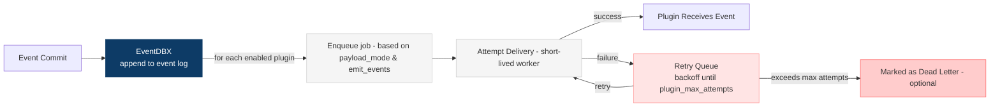

Plugins turn EventDBX into a hub: the write path stays lean while plugins fan events out to search, caches, analytics, or custom workers. Jobs are enqueued per enabled plugin when events commit; payload modes trim what each plugin receives.

## How it works



1. Events commit.
2. EventDBX enqueues a job per enabled plugin (respecting its payload mode and `emit_events` flag).
3. A short-lived delivery is attempted; failures stay in the queue and retry with backoff until `plugin_max_attempts`.

### Explicit publish (opt-in)

You can override the default “fan out to all enabled plugins” on a per-write basis. Provide publish targets on the write command to select plugins, override payload mode, and set queue priority:

```bash
dbx aggregate apply orders order-1 order_created \
  --payload '{"status":"pending"}' \
  --publish search-indexer:all:high \
  --publish analytics-engine:state-only
```

More examples:

```bash
# Patch an event and send only to the ETL plugin with default priority
dbx aggregate patch orders order-1 order_created \
  --patch '[{ "op": "replace", "path": "/status", "value": "paid" }]' \
  --publish etl:state-only

# Create and fan out to two plugins with different modes and priority
dbx aggregate create orders order-2 order_created \
  --payload '{"status":"pending"}' \
  --publish search-indexer:event-only:high \
  --publish audit-log:all
```

Each `--publish` entry is `PLUGIN[:MODE[:PRIORITY]]`:

- `PLUGIN` – configured plugin name (must be enabled).
- `MODE` (optional) – overrides payload shape for this write (`all`, `event-only`, `state-only`, `schema-only`, `event-and-schema`, `extensions-only`); defaults to the plugin’s configured mode.
- `PRIORITY` (optional) – `low|normal|high` for queue ordering; defaults to `normal`.

If no publish targets are provided, EventDBX fans out to all enabled plugins using their configured payload modes.

## Configure plugins

Use `dbx plugin config <type>` to create or update an instance (saved at the system data root, e.g. `~/.eventdbx/plugins.json`):

```bash
dbx plugin config http --name search --endpoint https://search.internal/hooks --payload event-only
dbx plugin config tcp --name fraud --host fraud.internal --port 7075 --payload state-only
dbx plugin config log --name audit --level info --template "agg={aggregate} id={id} event={event}"
dbx plugin config process --name enrich --plugin dbx_enrich --version 1.0.0 --payload all
```

Start/stop managed process workers:

```bash
dbx plugin start enrich
dbx plugin status enrich
dbx plugin stop enrich
```

List and test:

```bash
dbx plugin list
dbx plugin test [<name>…]
```

## Payload modes

- `all` (default): event + state + schema.
- `event-only`: event document only.
- `state-only`: latest state only.
- `schema-only`: aggregate schema only.
- `event-and-schema`: event + schema, no state.
- `extensions-only`: identifiers + namespaced extensions; payload/state nulled out.

## Retries and backpressure

- Jobs retry automatically up to `plugin_max_attempts` (set via `dbx config --plugin-max-attempts <n>`).
- When the persistent queue is unavailable, EventDBX attempts direct delivery and logs failures.
- Use `dbx queue` to inspect pending and dead jobs; `dbx queue retry` replays failures.

## Deployment options

- TCP/HTTP/Capnp/Log plugins run as lightweight emitters inside the server/CLI process.
- Process plugins run as supervised binaries; EventDBX starts/stops them and writes status files under the domain data directory.

Dive into transport-specific guides for configuration details and payload examples.
